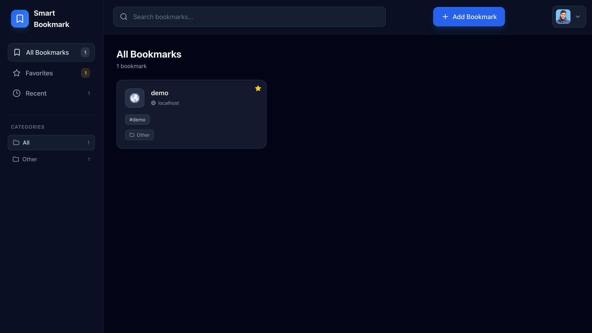

# Smart Bookmark App



A modern bookmark manager built with Next.js 14, Supabase, and Tailwind CSS. Features Google OAuth authentication, real-time updates, favorites, categories, and a responsive dark-themed UI.

## Features

- **Google OAuth Authentication** - Secure login with Google
- **CRUD Operations** - Add, edit, and delete bookmarks
- **Categories** - 10 predefined categories (Development, Design, Reference, Work, Education, Shopping, News, Social, Entertainment, Other)
- **Tags** - Add comma-separated tags to bookmarks
- **Favorites** - Mark bookmarks as favorites (stored in localStorage)
- **Recent View** - Access your 10 most recent bookmarks
- **Real-time Updates** - See changes instantly across devices
- **Search** - Search by title, URL, tags, or category
- **Responsive Design** - Works on desktop and mobile
- **Dark Theme** - Beautiful slate/dark color scheme

## Tech Stack

- **Frontend**: Next.js 14 with TypeScript (App Router)
- **Styling**: Tailwind CSS
- **Backend**: Supabase (Authentication + Database + Realtime)
- **Icons**: Lucide React
- **Notifications**: SweetAlert2 + React Hot Toast

---

## Problems Faced & Solutions

### 1. Schema Cache Error - Missing Columns

**Problem:** When adding bookmarks: `Could not find the 'category' column of 'bookmarks' in the schema cache`

**Solution:** The initial schema was missing columns. Added them via SQL:
```sql
ALTER TABLE bookmarks
ADD COLUMN IF NOT EXISTS tags TEXT[] DEFAULT '{}',
ADD COLUMN IF NOT EXISTS category TEXT DEFAULT 'Other';
```

### 2. Google Auth Profile Image Not Appearing

**Problem:** User's Google profile picture wasn't showing.

**Solution:** Replaced deprecated `getSession()` with `getUser()`:
```typescript
const { data: { user } } = await supabase.auth.getUser()
```

### 3. Form Submit Not Working

**Problem:** Clicking "Add Bookmark" did nothing.

**Solution:** The sidebar was closing before async save completed. Restructured so parent controls when to close after successful save.

### 4. TypeScript Category Filtering Error

**Problem:** `string | undefined` not assignable to `string`

**Solution:** Used type predicate:
```typescript
.filter((c): c is string => Boolean(c))
```

---

## Authentication & User Privacy

### How Authentication Works

1. User clicks "Sign in with Google"
2. Supabase redirects to Google OAuth
3. Google returns auth code to callback route
4. Code exchanged for session in HTTP-only cookies
5. Session verified on every page load

### User Privacy - Row Level Security

```sql
CREATE POLICY "Users can view their own bookmarks"
  ON bookmarks FOR SELECT
  USING (auth.uid() = user_id);

CREATE POLICY "Users can insert their own bookmarks"
  ON bookmarks FOR INSERT
  WITH CHECK (auth.uid() = user_id);

CREATE POLICY "Users can update their own bookmarks"
  ON bookmarks FOR UPDATE
  USING (auth.uid() = user_id);

CREATE POLICY "Users can delete their own bookmarks"
  ON bookmarks FOR DELETE
  USING (auth.uid() = user_id);
```

Users can ONLY access their own data - enforced at database level.

---

## Real-Time Updates

```typescript
const channel = supabase
  .channel('bookmarks-changes')
  .on('postgres_changes', {
    event: '*',
    schema: 'public',
    table: 'bookmarks',
    filter: `user_id=eq.${user.id}`,
  }, () => fetchBookmarks())
  .subscribe()
```

WebSocket-based updates using Supabase Postgres Changes.

---

## Setup Instructions

### 1. Create Supabase Project

1. Go to [supabase.com](https://supabase.com)
2. Create project and note URL/anon key from Settings > API

### 2. Configure Google OAuth

1. Create OAuth credentials in Google Cloud Console
2. In Supabase: Authentication > Providers > Enable Google
3. Add redirect: `https://YOUR_PROJECT.supabase.co/auth/v1/callback`

### 3. Create Database

```sql
CREATE TABLE bookmarks (
  id UUID DEFAULT gen_random_uuid() PRIMARY KEY,
  user_id UUID REFERENCES auth.users(id) ON DELETE CASCADE NOT NULL,
  title TEXT NOT NULL,
  url TEXT NOT NULL,
  tags TEXT[] DEFAULT '{}',
  category TEXT DEFAULT 'Other',
  created_at TIMESTAMP WITH TIME ZONE DEFAULT NOW()
);

ALTER TABLE bookmarks ENABLE ROW LEVEL SECURITY;

CREATE POLICY "Users can view their own bookmarks"
  ON bookmarks FOR SELECT USING (auth.uid() = user_id);

CREATE POLICY "Users can insert their own bookmarks"
  ON bookmarks FOR INSERT WITH CHECK (auth.uid() = user_id);

CREATE POLICY "Users can update their own bookmarks"
  ON bookmarks FOR UPDATE USING (auth.uid() = user_id);

CREATE POLICY "Users can delete their own bookmarks"
  ON bookmarks FOR DELETE USING (auth.uid() = user_id);

ALTER PUBLICATION supabase_realtime ADD TABLE bookmarks;
```

### 4. Configure Environment

Create `.env.local`:
```
NEXT_PUBLIC_SUPABASE_URL=https://your-project.supabase.co
NEXT_PUBLIC_SUPABASE_ANON_KEY=your-anon-key
```

### 5. Run

```bash
npm install
npm run dev
```

---

## Project Structure

```
src/
├── app/
│   ├── auth/callback/route.ts  # OAuth callback
│   ├── globals.css             # Tailwind + animations
│   ├── layout.tsx              # Root layout
│   └── page.tsx                # Entry point
├── components/
│   ├── AddBookmarkSidebar.tsx  # Add/Edit form
│   ├── Auth.tsx                # Login page
│   ├── BookmarkCard.tsx        # Bookmark card
│   ├── Dashboard.tsx           # Main app
│   ├── MobileMenu.tsx          # Mobile nav
│   └── ProfileMenu.tsx         # User dropdown
├── lib/
│   ├── supabase-client.ts      # Browser client
│   └── supabase-server.ts      # Server client
└── types/
    └── index.ts                # TypeScript types
```

---

## Video Walkthrough Script (3-5 Minutes)

### Introduction (30 sec)
"Hi, I'm [Name]. This is Smart Bookmark - a bookmark manager with Google OAuth, real-time updates, and a polished UI built with Next.js and Supabase."

### Feature Demo (1.5 min)
- Login with Google OAuth
- Dashboard with bookmark cards
- Search by title, URL, tags, category
- Categories filtering in sidebar
- Add bookmark form (title, URL, tags, category)
- Favorites feature
- Edit and delete with confirmations

### Authentication & Privacy (1 min)
- OAuth flow: redirect to Google, callback with code, exchange for session
- RLS policies ensure users only see their own data
- Privacy enforced at database level, not just client

### Real-Time (45 sec)
- WebSocket subscription to Postgres changes
- INSERT/UPDATE/DELETE events trigger refresh
- Changes sync across devices instantly

### Challenges (1 min)
1. Schema cache error - added missing columns
2. Profile images - switched to getUser()
3. Form not submitting - fixed async close timing
4. TypeScript errors - type predicates in filters

### Conclusion (30 sec)
"That's Smart Bookmark - fully functional with auth, privacy, real-time, and great UX. Code and docs available on GitHub."

---

## License

MIT
